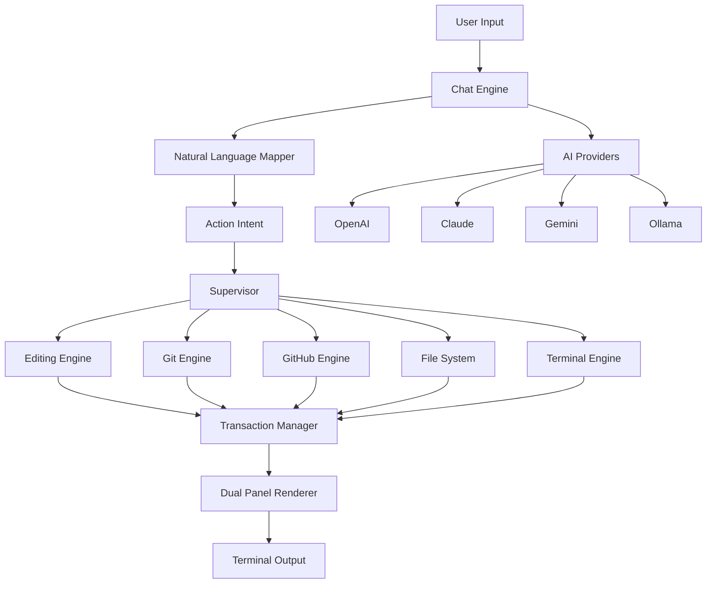

<div align="center">

```
    ██████╗ ██╗████████╗██╗   ██╗██╗███████╗██╗ ██████╗ ███╗   ██╗
   ██╔════╝ ██║╚══██╔══╝██║   ██║██║██╔════╝██║██╔═══██╗████╗  ██║
   ██║  ███╗██║   ██║   ██║   ██║██║███████╗██║██║   ██║██╔██╗ ██║
   ██║   ██║██║   ██║   ╚██╗ ██╔╝██║╚════██║██║██║   ██║██║╚██╗██║
   ╚██████╔╝██║   ██║    ╚████╔╝ ██║███████║██║╚██████╔╝██║ ╚████║
    ╚═════╝ ╚═╝   ╚═╝     ╚═══╝  ╚═╝╚══════╝╚═╝ ╚═════╝ ╚═╝  ╚═══╝
```

# **GitVisionCLI**

### 🚀 **AI-Powered Terminal IDE with Git Superpowers** 🚀

[](https://www.python.org/downloads/)
[](https://opensource.org/licenses/MIT)
[](https://github.com/psf/black)
[](https://github.com)
[](https://github.com/NikanEidi/GitVisionCLI)

**The Most Advanced Terminal IDE You'll Ever Use**

[Features](#-features) • [Installation](#-installation) • [Quick Start](#-quick-start) • [Documentation](#-documentation) • [Commands](#-commands) • [Examples](#-examples)

---

</div>

## 🎯 **What is GitVisionCLI?**

**GitVisionCLI** is a **revolutionary terminal IDE** that combines the power of **AI, Git, and an intuitive dual-panel interface** to transform how you code. It's like having a **smart assistant, version control, and code editor** all in one beautiful terminal interface.

### ✨ **Why GitVisionCLI?**

<div align="center">

| Feature | GitVisionCLI | Traditional CLI | VS Code |
|---------|--------------|-----------------|---------|
| **AI Integration** | ✅ Built-in, Multi-model | ❌ Third-party tools | ⚠️ Extensions |
| **Natural Language** | ✅ `remove line 5` | ❌ Manual editing | ⚠️ Limited |
| **Git Workflow** | ✅ Seamless, Visual | ⚠️ Context switching | ⚠️ Separate tools |
| **GitHub Sync** | ✅ Direct commands | ❌ Manual browser | ⚠️ Extensions |
| **Dual Panels** | ✅ AI + Workspace | ❌ Single view | ⚠️ Split view |
| **Multi-Model AI** | ✅ Any LLM (OpenAI/Gemini/Claude/Ollama) | ❌ Locked-in | ⚠️ Limited |
| **Terminal Native** | ✅ Fast & Clean | ✅ Fast | ❌ GUI bloat |
| **Streaming** | ✅ Token-by-token | ❌ N/A | ⚠️ Limited |
| **Zero Questions** | ✅ Context-aware | ❌ Manual | ⚠️ Prompts |

</div>

---

## 🌟 **Features**

### 🤖 **AI-Powered Editing**

- **Natural language commands**: `remove line 5`, `add comment at top`, `edit line 3 with new code`
- **Zero clarification loops**: Instant execution when file is open
- **Multi-model support**: OpenAI (GPT-4), Claude (3.5 Sonnet), Gemini (1.5 Pro), Ollama (local)
- **Context-aware**: Understands your code structure automatically
- **Full streaming**: Token-by-token AI responses with live editor updates
- **Tool support**: All models support function calling and structured outputs

### 📝 **Smart File Operations**

**Single-line creation:**
```bash
create a file called app.py with print("Hello!")
```

**Multiline creation:**
```bash
:ml
create a file called main.py with
def main():
    print("GitVision")
    return 0

if __name__ == "__main__":
    main()
:end
```

**All operations supported:**
- ✅ Create, read, delete, rename, move, copy files
- ✅ Create, delete, move, copy, rename folders
- ✅ Search files by name or content
- ✅ Find files with patterns

### 🌳 **Integrated Git Workflow**

```bash
git init
git add .
git commit "Initial commit"
:git-graph          # Visual commit tree
git branch feature
git checkout feature
git merge main
git push
git pull
```

**Complete Git support:**
- ✅ Init, add, commit, push, pull
- ✅ Branch, checkout, merge
- ✅ Status, log, remote management
- ✅ Visual commit graph (`:git-graph`)
- ✅ Real-time Git status in UI

### 🐙 **Direct GitHub Integration**

```bash
create github repo my-project --private
git push -u origin main
create github issue "Bug fix needed"
create github pr "New feature"
```

**GitHub features:**
- ✅ Create private/public repositories
- ✅ Create issues (with or without body)
- ✅ Create pull requests
- ✅ Automatic authentication
- ✅ Organization support

### 🎨 **Beautiful Dual-Panel UI with Neon Purple Theme**

```
┌─────────────────────────────────┬──────────────────────────────────┐
│         AI CONSOLE              │      WORKSPACE PANEL             │
├─────────────────────────────────┼──────────────────────────────────┤
│  💬 Chat with AI                │  📁 File Tree Browser             
│  🔧 Tool execution logs         │  ✏️  Code Editor (line numbers)   │
│  📊 Status updates               │  📊 Git Graph Visualization       │
│  🎨 Neon Purple Theme            │  📄 Markdown Renderer             │
│  ⚡ Real-time streaming          │  📚 Command Reference              
│  🎯 Context-aware responses      │  🔍 Search & Find                 │
└─────────────────────────────────┴──────────────────────────────────┘
```

**UI Features:**
- **Neon Purple Borders** - Vibrant purple frame borders throughout
- **Gradient Effects** - Smooth color transitions for modern look
- **ANSI-Aware Rendering** - Proper escape sequence handling
- **Zero Flicker** - Smooth, stable frame updates
- **Responsive Layout** - Adapts to terminal size
- **Syntax Highlighting** - Basic syntax awareness in editor

### ⚡ **Lightning-Fast Line Editing**

When a file is open in `:edit`, all operations are **instant**:

| Command | What It Does | Example |
|---------|--------------|---------|
| `remove line N` | Delete line | `remove line 5` |
| `delete line N` | Delete line | `delete line 10` |
| `delete lines N-M` | Remove range | `delete lines 5-10` |
| `add line N with X` | Insert before line | `add line 1 with # comment` |
| `insert line N with X` | Insert before line | `insert line 5 with x = 42` |
| `edit line N with X` | Replace line | `edit line 3 with x = 100` |
| `replace line N with X` | Replace line | `replace line 2 with new code` |
| `add X at bottom` | Append to end | `add print("end") at bottom` |

**Grammar auto-fix:**
- `remove line1` → `remove line 1`
- `delete ln5` → `delete line 5`
- `rm 2` → `remove line 2` (when file is open)

### 🔥 **Key Highlights**

- 🚫 **No "Please specify file..."** - Direct execution when context is clear
- 🎨 **Clean UI** - No duplicate panels, smooth rendering, neon purple theme
- 📦 **Complete Git** - Init, branch, merge, push, pull, graph, remote
- 🌐 **GitHub Native** - Create repos, issues, PRs from terminal
- 🔄 **Multi-Model** - Switch between AI providers instantly
- 📚 **Smart Panels** - `:banner`, `:tree`, `:sheet`, `:git-graph`, `:edit`, `:models`
- ⚡ **Full Streaming** - All models support token-by-token streaming
- 🛠️ **Tool Support** - All models support function calling
- 🔍 **Search & Find** - Search files, find by name, grep patterns
- 🐚 **Shell Commands** - All standard shell commands (ls, cd, grep, find, etc.)

---

## 🚀 **Installation**

### **Prerequisites**

<table>
<tr>
<td width="50%">

**Required**
- Python 3.9+
- Git
- Terminal (iTerm2, Alacritty, or default)

</td>
<td width="50%">

**AI Provider** (pick one or more)
- OpenAI API key
- Claude API key
- Gemini API key
- Ollama (local, free)

</td>
</tr>
</table>

### **Install with pipx** (Recommended)

```bash
# Install pipx if needed
python3 -m pip install pipx
python3 -m pipx ensurepath

# Install GitVisionCLI
cd /path/to/GitVisionCLI
pipx install -e .
```

### **Or with pip**

```bash
pip install -e .
```

### **Set API Keys**

```bash
# Choose your AI provider (at least one)
export OPENAI_API_KEY="sk-..."              # For GPT-4
export ANTHROPIC_API_KEY="sk-ant-..."       # For Claude
export GOOGLE_API_KEY="..."                 # For Gemini (get from https://makersuite.google.com/app/apikey)

# Optional: GitHub integration
export GITHUB_TOKEN="ghp_..."
```

**Note:** After setting Gemini API key, switch to Gemini:
```bash
gitvision
:set-ai gemini-1.5-pro
```

### **Launch** 🎉

```bash
gitvision
```

Or use the interactive mode:
```bash
gitvision interactive
```

---

## ⚡ **Quick Start**

### **1. Create Your First Project**

```bash
# Launch GitVision
gitvision

# Initialize Git
git init

# Create a file (multiline)
:ml
create a file called app.py with
#!/usr/bin/env python3
# -*- coding: utf-8 -*-

def greet(name):
    """Greet someone by name."""
    return f"Hello, {name}!"

def main():
    user = "World"
    message = greet(user)
    print(message)

if __name__ == "__main__":
    main()
:end
```

### **2. Edit with Natural Language**

```bash
# Open in editor
:edit app.py

# Now edit it (no need to specify filename - it's open!)
add line 1 with # My first GitVision file
replace line 4 with     user = input("Your name: ")
remove line 15
add print("End of file") at bottom
```

### **3. Git Workflow**

```bash
# Stage and commit
git add .
git commit "Initial commit with greeting app"

# View history
:git-graph

# Create GitHub repo and push
create github repo greeting-app --private
git push -u origin main
```

### **4. Explore Panels**

```bash
:banner         # Quick commands
:sheet          # Full command reference
:tree           # File browser
:git-graph      # Commit visualization
:models         # AI model manager
```

### **5. Use AI**

```bash
# Ask questions about your code
explain the file app.py
how can I improve this code?
find bugs in this file
refactor this function
create a test file for app.py
```

---

## 📚 **Documentation**

<div align="center">

| Document | Description | Link |
|----------|-------------|------|
| **[QUICKSTART.md](docs/QUICKSTART.md)** | 5-minute getting started guide | [Read →](docs/QUICKSTART.md) |
| **[COMMANDS.md](docs/COMMANDS.md)** | Complete command reference with examples | [Read →](docs/COMMANDS.md) |
| **[FEATURES.md](docs/FEATURES.md)** | In-depth feature documentation | [Read →](docs/FEATURES.md) |
| **[RUN_AND_TEST.md](docs/RUN_AND_TEST.md)** | Comprehensive testing and validation guide | [Read →](docs/RUN_AND_TEST.md) |
| **[CONTRIBUTING.md](CONTRIBUTING.md)** | How to contribute to GitVisionCLI | [Read →](CONTRIBUTING.md) |
| **[CHANGELOG.md](CHANGELOG.md)** | Version history and changes | [Read →](CHANGELOG.md) |

</div>

---

## 🎮 **Commands**

### **Essential Commands**

```bash
gitvision                          # Launch GitVisionCLI
gitvision interactive              # Launch in interactive mode
:banner                            # Show quick reference
:sheet                             # Full command list
:tree                              # File browser
:edit <file>                       # Open file in editor
:live-edit <file>                  # AI live editor (streaming)
:git-graph                         # Visual commit history
:models                            # AI model manager
exit / quit                        # Exit GitVision
```

### **File Operations**

```bash
# Create
create file <name> with <content>
create folder <name>

# Read
read file <name>
list files in <dir>

# Modify
rename <old> to <new>
move <file> to <dest>
copy <file> to <dest>

# Delete
delete file <name>
delete folder <name>
```

### **Line Editing** (when file open in `:edit`)

```bash
remove line <N>                    # Delete line N
delete lines <N>-<M>               # Delete range
add <text> at line <N>            # Insert after line N
insert <text> at line <N>          # Insert before line N
replace line <N> with <text>       # Replace line N
add <text> at bottom               # Append to end
```

### **Shell Commands** (All Supported!)

```bash
# Navigation
pwd, cd <path>, cd ..

# File operations
ls, cat, head, tail, grep, find, touch, mkdir, rm, cp, mv

# System
whoami, uname, date, ps, top, kill

# Network
ping, curl, wget, netstat

# Text processing
grep, sed, awk, sort, wc, cut, tr

# Package managers
pip, npm, yarn, brew, apt, yum

# Debugging
python, python3, node, debug, test

# And many more!
```

### **Natural Language Commands**

```bash
# File operations
list files in <dir>
run <script>
debug <file>
test <file>
search for <text>
find files named <name>

# Navigation
navigate to <path>
go to <folder>
```

### **Git Commands**

```bash
git init
git add <files>
git add .
git commit "<message>"
git status
git log
git branch <name>
git checkout <branch>
git merge <branch>
git push
git pull
git remote add <name> <url>
```

### **GitHub Integration**

```bash
create github repo <name> --private
create github repo <name> --public
create github issue "<title>"
create github issue "<title>" --body "<description>"
create github pr "<title>"
```

### **AI Commands**

```bash
explain <file>
analyze this code
find bugs
refactor this
create test for <file>
optimize this code
```

### **Panel Navigation**

```bash
:banner                            # Quick command list
:sheet                             # Full command sheet
:tree                              # File browser
:git-graph                         # Commit graph
:edit <filename>                   # Code editor
:live-edit <filename>              # AI live editor
:markdown <filename>               # Markdown preview
:models                            # AI model manager
:close                             # Close current panel
```

---

## 🏗️ **Architecture**

<div align="center">



</div>

### **Core Components**

| Component | Purpose |
|-----------|---------|
| **Chat Engine** | Multi-provider AI integration (OpenAI, Claude, Gemini, Ollama) with full streaming support |
| **Natural Language Mapper** | Converts natural language → structured actions (zero questions!) |
| **Editing Engine** | Transactional file operations with rollback |
| **Supervisor** | Orchestrates all operations (files, Git, GitHub, shell) |
| **Git Engine** | Native Git workflow integration |
| **GitHub Engine** | Direct GitHub API integration |
| **Terminal Engine** | Universal shell command execution |
| **Dual Panel Renderer** | Beautiful ANSI-based UI with neon purple theme |

---

## 🎯 **Use Cases**

<table>
<tr>
<td width="50%">

### **Solo Development**
```bash
gitvision
git init
# Create and edit files
git add .
git commit "Feature complete"
git push
```

</td>
<td width="50%">

### **Code Review**
```bash
:edit app.py
analyze this code
find bugs
suggest improvements
refactor this function
```

</td>
</tr>
<tr>
<td>

### **Quick Prototyping**
```bash
create a flask app with auth
add database models
create API endpoints
test the endpoints
```

</td>
<td>

### **Learning**
```bash
explain how this works
what are design patterns here?
how can I optimize this?
show me best practices
```

</td>
</tr>
<tr>
<td>

### **Debugging**
```bash
:edit buggy.py
run buggy.py
debug buggy.py
find bugs
fix this error
```

</td>
<td>

### **GitHub Workflow**
```bash
git branch feature
# Make changes
git commit "New feature"
create github pr "Add feature"
```

</td>
</tr>
</table>

---

## 🔥 **What Makes It Special**

<div align="center">

### **Terminal-First Philosophy**

| Benefit | Description |
|---------|-------------|
| ⚡ **Fast** | No browser overhead, instant responses |
| 🎨 **Clean** | Minimal UI, maximum productivity, neon purple theme |
| 🔐 **Secure** | Local-first, API keys stay in ENV |
| 🛠️ **Powerful** | Full Git + AI + IDE + Shell in one tool |
| 🌈 **Beautiful** | Neon cyberpunk aesthetics with gradient effects |
| 🔄 **Flexible** | Switch AI models on the fly |
| 📊 **Visual** | Git graph, file tree, live editor |

</div>

### **Key Differentiators**

1. **Zero Clarification Loops** - When context is clear, execute immediately
2. **Multi-Model AI** - Use any LLM (OpenAI, Gemini, Claude, Ollama) with full streaming
3. **Complete Git Integration** - Visual graph, seamless workflow
4. **Direct GitHub** - Create repos, issues, PRs without leaving terminal
5. **Natural Language** - Speak naturally, GitVision understands
6. **All Shell Commands** - Every standard command works (ls, cd, grep, find, etc.)
7. **Live Streaming** - Watch AI write code token-by-token
8. **Context-Aware** - Remembers open files, project structure, recent edits

---

## 🤝 **Contributing**

We welcome contributions! See [CONTRIBUTING.md](CONTRIBUTING.md) for guidelines.

```bash
# Fork and clone
git clone https://github.com/NikanEidi/GitVisionCLI
cd GitVisionCLI

# Create branch
git checkout -b feature-amazing

# Make changes
# ...

# Test
pytest tests/

# Commit and push
git add .
git commit "Add amazing feature"
git push origin feature-amazing
```

---

## 📜 **License**

MIT License - See [LICENSE](LICENSE)

---

## 🌟 **Show Your Support**

If you find GitVisionCLI useful, please ⭐ **star the repo**!

---

<div align="center">


[](https://www.python.org/)
[](https://github.com)
[](https://github.com)

**[Documentation](docs/) • [Report Bug](https://github.com/NikanEidi/GitVisionCLI/issues) • [Request Feature](https://github.com/NikanEidi/GitVisionCLI/issues)**

---

```
© 2025 GitVisionCLI • Where AI Meets Terminal Excellence
```

**Version**: 2.0.0  
**Last Updated**: 2025-11-24

</div>
