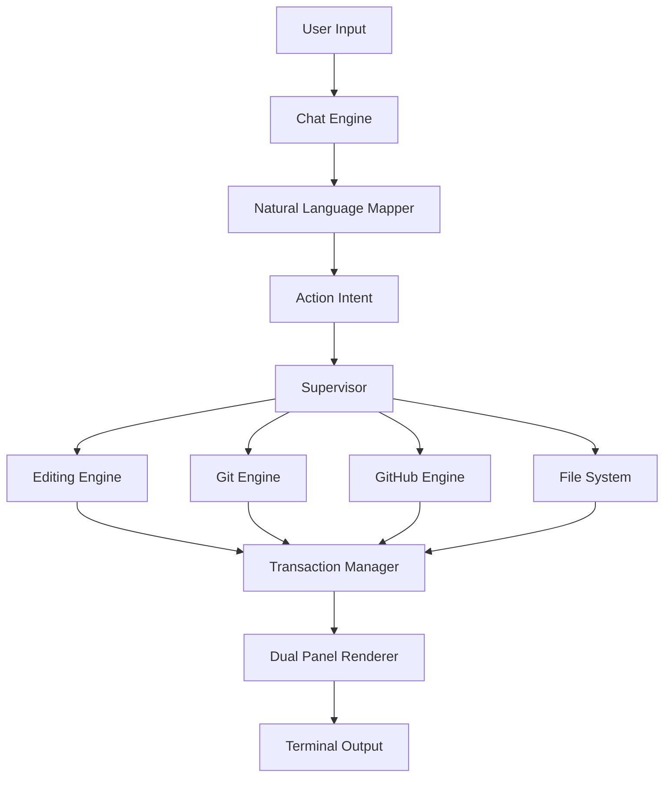

<div align="center">

```
    ██████╗ ██╗████████╗██╗   ██╗██╗███████╗██╗ ██████╗ ███╗   ██╗
   ██╔════╝ ██║╚══██╔══╝██║   ██║██║██╔════╝██║██╔═══██╗████╗  ██║
   ██║  ███╗██║   ██║   ██║   ██║██║███████╗██║██║   ██║██╔██╗ ██║
   ██║   ██║██║   ██║   ╚██╗ ██╔╝██║╚════██║██║██║   ██║██║╚██╗██║
   ╚██████╔╝██║   ██║    ╚████╔╝ ██║███████║██║╚██████╔╝██║ ╚████║
    ╚═════╝ ╚═╝   ╚═╝     ╚═══╝  ╚═╝╚══════╝╚═╝ ╚═════╝ ╚═╝  ╚═══╝
```

# **GitVisionCLI**

### 🚀 **AI-Powered Terminal IDE with Git Superpowers** 🚀

[](https://www.python.org/downloads/)
[](https://opensource.org/licenses/MIT)
[](https://github.com/psf/black)
[](https://github.com)

**The Most Advanced Terminal IDE You'll Ever Use**

[Features](#-features) • [Installation](#-installation) • [Quick Start](#-quick-start) • [Documentation](#-documentation) • [Commands](#-commands)

---

</div>

## 🎯 **What is GitVisionCLI?**

GitVisionCLI is a **revolutionary terminal IDE** that combines the power of **AI, Git, and an intuitive dual-panel interface** to transform how you code.

<div align="center">

### ✨ **Why GitVisionCLI?** ✨

| Feature | GitVisionCLI | Traditional CLI |
|---------|--------------|-----------------|
| **AI Integration** | ✅ Built-in | ❌ Third-party tools |
| **Natural Language** | ✅ `remove line 5` | ❌ Manual editing |
| **Git Workflow** | ✅ Seamless | ⚠️ Context switching |
| **GitHub Sync** | ✅ Direct | ❌ Manual browser |
| **Dual Panels** | ✅ AI + Workspace | ❌ Single view |
| **Multi-Model AI** | ✅ Any LLM | ❌ Locked-in |
| **Terminal Native** | ✅ Fast & Clean | ⚠️ GUI bloat |

</div>

---

## 🌟 **Features**

### 🤖 **AI-Powered Editing**
- **Natural language commands**: `remove line 5`, `add comment at top`, `edit line 3 with new code`
- **Zero clarification loops**: Instant execution when file is open
- **Multi-model support**: OpenAI, Claude, Gemini, Ollama
- **Context-aware**: Understands your code structure

### 📝 **Smart File Operations**
```bash
create a file called app.py with print("Hello!")  # Single line
:ml                                                # Multiline mode
create a file called main.py with
def main():
    print("GitVision")
:end                                               # Execute
```

### 🌳 **Integrated Git Workflow**
```bash
git init
git add .
git commit "Initial commit"
:git-graph          # Visual commit tree
git push
```

### 🐙 **Direct GitHub Integration**
```bash
create github repo my-project --private
git push -u origin main
create github issue "Bug fix needed"
create github pr "New feature"
```

### 🎨 **Beautiful Dual-Panel UI**

```
┌─────────────────────────────────┬──────────────────────────────────┐
│         AI CONSOLE              │      WORKSPACE PANEL             │
├─────────────────────────────────┼──────────────────────────────────┤
│  💬 Chat with AI                │  📁 File Tree Browser             
│  🔧 Tool execution logs         │  ✏️  Code Editor (line numbers)   │
│  📊 Status updates               │  📊 Git Graph Visualization       │
│  🎨 Neon-themed interface        │  📄 Markdown Renderer             │
│  ⚡ Real-time streaming          │  📚 Command Reference              
└─────────────────────────────────┴──────────────────────────────────┘
```

### ⚡ **Lightning-Fast Line Editing**

| Command | What It Does | Example |
|---------|--------------|---------|
| `remove line N` | Delete line | `remove line 5` |
| `add line N with X` | Insert before line | `add line 1 with # comment` |
| `edit line N with X` | Replace line | `edit line 3 with x = 100` |
| `delete lines N-M` | Remove range | `delete lines 5-10` |
| `replace line N with X` | Same as edit | `replace line 2 with new code` |

### 🔥 **Key Highlights**

- 🚫 **No "Please specify file..."** - Direct execution when context is clear
- 🎨 **Clean UI** - No duplicate panels, smooth rendering
- 📦 **Complete Git** - Init, branch, merge, push, pull, graph
- 🌐 **GitHub Native** - Create repos, issues, PRs from terminal
- 🔄 **Multi-Model** - Switch between AI providers instantly
- 📚 **Smart Panels** - `:banner`, `:tree`, `:sheet`, `:git-graph`, `:edit`

---

## 🚀 **Installation**

### **Prerequisites**

<table>
<tr>
<td>

**Required**
- Python 3.9+
- Git
- Terminal (iTerm2, Alacritty, or default)

</td>
<td>

**AI Provider** (pick one or more)
- OpenAI API key
- Claude API key
- Gemini API key
- Ollama (local, free)

</td>
</tr>
</table>

### **Install with pipx** (Recommended)

```bash
# Install pipx if needed
python3 -m pip install pipx
python3 -m pipx ensurepath

# Install GitVisionCLI
cd /path/to/GitVisionCLI
pipx install -e .
```

### **Or with pip**

```bash
pip install -e .
```

### **Set API Keys**

```bash
# Choose your AI provider
export OPENAI_API_KEY="sk-..."              # For GPT-4
export ANTHROPIC_API_KEY="sk-ant-..."       # For Claude
export GOOGLE_API_KEY="..."                 # For Gemini

# Optional: GitHub integration
export GITHUB_TOKEN="ghp_..."
```

### **Launch** 🎉

```bash
gitvision
```

---

## ⚡ **Quick Start**

### **1. Create Your First Project**

```bash
# Launch GitVision
gitvision

# Initialize Git
git init

# Create a file (multiline)
:ml
create a file called app.py with
#!/usr/bin/env python3

def greet(name):
    """Greet someone by name."""
    return f"Hello, {name}!"

def main():
    user = "World"
    message = greet(user)
    print(message)

if __name__ == "__main__":
    main()
:end
```

### **2. Edit with Natural Language**

```bash
# Open in editor
:edit app.py

# Make changes with natural language
add line 1 with # -*- coding: utf-8 -*-
edit line 10 with     user = input("Your name: ")
remove line 15
```

### **3. Git Workflow**

```bash
# Stage and commit
git add .
git commit "Initial commit with greeting app"

# View history
:git-graph

# Create GitHub repo and push
create github repo greeting-app --private
git push -u origin main
```

### **4. Explore Panels**

```bash
:banner         # Quick commands
:sheet          # Full command reference
:tree           # File browser
:git-graph      # Commit visualization
```

---

## 📚 **Documentation**

<div align="center">

| Document | Description |
|----------|-------------|
| **[QUICKSTART.md](docs/QUICKSTART.md)** | 5-minute getting started guide |
| **[COMMANDS.md](docs/COMMANDS.md)** | Complete command reference with examples |
| **[FEATURES.md](docs/FEATURES.md)** | In-depth feature documentation |
| **[TESTING_GUIDE.md](TESTING_GUIDE.md)** | Comprehensive testing walkthrough |
| **[CONTRIBUTING.md](CONTRIBUTING.md)** | How to contribute to GitVisionCLI |

</div>

---

## 🎮 **Commands**

### **Essential Commands**

```bash
gitvision                          # Launch GitVisionCLI
:banner                            # Show quick reference
:sheet                             # Full command list
:tree                              # File browser
:edit <file>                       # Open file in editor
:git-graph                         # Visual commit history
exit / quit                        # Exit GitVision
```

### **File Operations**

```bash
create a file called <name> with <content>
read file <name>
delete file <name>
rename <old> to <new>
```

### **Line Editing** (when file is open in `:edit`)

```bash
remove line <N>                    # Delete line N
add line <N> with <text>           # Insert before line N
edit line <N> with <text>          # Replace line N
delete lines <N>-<M>               # Delete range
```

### **Git Commands**

```bash
git init
git add <file>
git add .
git commit "<message>"
git branch <name>
git checkout <name>
git merge <name>
git push
git pull
git log
git status
```

### **GitHub Integration**

```bash
create github repo <name> --private
create github repo <name> --public
create github issue "<title>" --body "<text>"
create github pr "<title>" --head <branch> --base main
```

### **AI Commands**

```bash
explain the file <name>
analyze this code
find bugs in this file
create a test file for <name>
refactor this function
```

### **Panel Navigation**

```bash
:banner                            # Quick command list
:sheet                             # Full command sheet
:tree                              # File browser
:git-graph                         # Commit graph
:edit <filename>                   # Code editor
```

---

## 🏗️ **Architecture**

<div align="center">



</div>

### **Core Components**

| Component | Purpose |
|-----------|---------|
| **Chat Engine** | Multi-provider AI integration (OpenAI, Claude, Gemini) |
| **Natural Language Mapper** | Converts natural language → structured actions |
| **Editing Engine** | Transactional file operations with rollback |
| **Supervisor** | Orchestrates all operations |
| **Git Engine** | Native Git workflow integration |
| **Dual Panel Renderer** | Beautiful ANSI-based UI |

---

## 🎯 **Use Cases**

<table>
<tr>
<td width="50%">

### **Solo Development**
```bash
gitvision
git init
# Create and edit files
git add .
git commit "Feature complete"
git push
```

</td>
<td width="50%">

### **Code Review**
```bash
:edit app.py
analyze this code
find bugs
suggest improvements
refactor this function
```

</td>
</tr>
<tr>
<td>

### **Quick Prototyping**
```bash
create a flask app with auth
add database models
create API endpoints
test the endpoints
```

</td>
<td>

### **Learning**
```bash
explain how this works
what are design patterns here?
how can I optimize this?
show me best practices
```

</td>
</tr>
</table>

---

## 🔥 **What Makes It Special**

<div align="center">

### **Terminal-First Philosophy**

| Benefit | Description |
|---------|-------------|
| ⚡ **Fast** | No browser overhead, instant responses |
| 🎨 **Clean** | Minimal UI, maximum productivity |
| 🔐 **Secure** | Local-first, API keys stay in ENV |
| 🛠️ **Powerful** | Full Git + AI + IDE in one tool |
| 🌈 **Beautiful** | Neon cyberpunk aesthetics |

</div>

---

## 🤝 **Contributing**

We welcome contributions! See [CONTRIBUTING.md](CONTRIBUTING.md) for guidelines.

```bash
# Fork and clone
git clone https://github.com/YOUR_USERNAME/GitVisionCLI
cd GitVisionCLI

# Create branch
git checkout -b feature-amazing

# Make changes
# ...

# Test
pytest tests/

# Commit and push
git add .
git commit "Add amazing feature"
git push origin feature-amazing
```

---

## 📜 **License**

MIT License - See [LICENSE](LICENSE)

---

## 🌟 **Show Your Support**

If you find GitVisionCLI useful, please ⭐ star the repo!

---

<div align="center">

### **Built with ❤️ for developers who live in the terminal**

[](https://www.python.org/)
[](https://github.com)

**[Documentation](docs/) • [Report Bug](https://github.com/NikanEidi/GitVisionCLI/issues) • [Request Feature](https://github.com/NikanEidi/GitVisionCLI/issues)**

---

```
© 2024 GitVisionCLI • Where AI Meets Terminal Excellence
```

</div>
